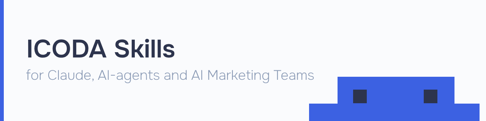

<p align="center">
  
</p>

# ICODA Skills — Claude Skills for AI Marketing Teams

<div align="center">

[](https://github.com/mgicoda/icoda-skills)
[](https://claude.ai)
[](./LICENSE)
[](https://icoda.io)

[](https://icoda.io/services/marketing-services/)
[](https://icoda.io/services/igaming-marketing/)
[](https://icoda.io/services/ai-seo/)

</div>

**2 production-ready Claude skills for AI visibility and brand reputation audits.**
Built by [ICODA](https://icoda.io) — a marketing agency with 17+ years of experience and 650+ clients in crypto, Web3, and iGaming.

> AI answers questions before users click. AI shapes brand perception before users decide.
> These skills tell you exactly where you stand — and what to fix first.

---

## Why ICODA Skills?

Most AI tools give you a chat interface. We give you **specialized audit agents** — built on years of hands-on experience in SEO, SERM, and AI optimization consulting.

- **No hallucination risk on scores** — each skill uses a fixed, documented scoring rubric
- **Actionable output** — every audit ends with a prioritized recommendation list, not just a summary
- **One-click install** — no API keys, no configuration, no dependencies
- **Built for agencies** — reports are designed to share with clients (inline HTML → PDF)

---

## Available Skills

| Skill | What it does | Output | Install |
|-------|-------------|--------|---------|
| [**aeo-audit**](#aeo-audit) | Audits any website for AI search readiness — AI bot access, structured data, content structure, technical signals | Score 0–100 · ROI-ranked fixes · HTML/PDF report | [↓ Download .skill](./aeo-audit/aeo-audit.skill) |
| [**serm-guard**](#serm-guard) | Full brand reputation audit across search & AI — auto-detects niche, 17–21 targeted searches, brand vs brand comparison | Score 0–100 · LLM perception verdict · Action roadmap | [↓ Download .skill](./serm-guard/serm-guard.skill) |

---

## Getting Started

### 1. Enable Skills in Claude.ai

Go to [claude.ai](https://claude.ai) → **Settings → Capabilities** → enable the **Skills** toggle.

> Skills are available for Pro, Max, Team, and Enterprise users.

### 2. Install a skill

**Option A — from this repo directly:**

1. Open any skill folder: [`aeo-audit`](./aeo-audit) or [`serm-guard`](./serm-guard)
2. Download the `SKILL.md` file
3. In Claude.ai → **Settings → Skills** → **Upload skill file**

**Option B — copy and paste:**

Open `SKILL.md` of any skill, copy the full content, and paste it into a new skill in Claude's settings.

### 3. Use it

Start a new chat. Claude automatically detects when your request matches an installed skill and activates it. No special commands needed — just describe what you want.

---

## Why a Skill Instead of Just a Prompt?

| | Prompt | Claude Skill |
|---|---|---|
| **Reusability** | Copy-paste every time | Installed once, always available |
| **Consistency** | Varies by session | Same methodology every run |
| **Complexity** | Limited by what fits in a message | Full workflows, scoring logic, reference files |
| **Sharing** | Manual | Install from a repo in seconds |
| **Maintenance** | Update every conversation | Update once in the file |

**Rule of thumb:** if you run the same audit or workflow more than once, make it a skill.

---

## aeo-audit

**Is your site invisible to ChatGPT, Claude, and Perplexity?**

Most sites block AI crawlers by accident — or lack the structured data that makes AI systems cite them. `aeo-audit` finds every gap across 4 weighted categories and tells you what to fix first.

### What it checks

| Category | Weight | What's analyzed |
|----------|--------|-----------------|
| 🤖 AI Bot Access | 20% | robots.txt rules for GPTBot, ClaudeBot, PerplexityBot, Google-Extended, CCBot |
| 🏷️ Structured Data | 35% | Schema.org JSON-LD, Open Graph, Twitter Cards, canonical tags |
| 📝 Content Structure | 25% | Heading hierarchy, semantic HTML, image alt attributes, internal links |
| ⚙️ Technical | 20% | HTTPS, XML sitemap, llms.txt |

### Output

- **Score 0–100** with per-category breakdown and weighted totals
- **ROI-ranked recommendations** — highest-impact fixes listed first
- **Print-ready HTML report** — open in browser, export as PDF

### Try it

```
Run a full AEO audit for stripe.com
```
```
Check if GPTBot and ClaudeBot are blocked for notion.so
```
```
Compare hubspot.com vs salesforce.com — which is better optimized for AI search?
```
```
Audit icoda.io for AI visibility and generate a PDF report
```

---

## serm-guard

**What does the internet say about your brand — and what would an AI say if asked?**

`serm-guard` runs up to 21 targeted searches across review platforms, forums, and news. It scores your reputation across 4 dimensions, delivers a plain-English LLM perception verdict, and gives you a prioritized action roadmap.

### What it scores

| Dimension | Weight | What's measured |
|-----------|--------|-----------------|
| 🔍 Search Sentiment | 35% | Position-weighted sentiment across all search results |
| 🤖 LLM Sentiment | 30% | How ChatGPT, Claude, and Perplexity would present the brand |
| 🎯 SERP Control | 20% | Share of brand-query results the brand owns or influences |
| 📊 Platform Presence | 15% | Coverage on Reddit, Trustpilot, Glassdoor, Quora, YouTube |

### Score scale

| Score | Status |
|-------|--------|
| 80–100 | ✅ Strong — well-protected in search and AI |
| 65–79 | 🟡 Good with gaps — vulnerabilities to address |
| 50–64 | 🟠 Needs attention — significant problems present |
| < 50 | 🔴 At risk — urgent action required |

### Auto-detected niches

`crypto` · `igaming` · `saas` · `agency` · `ecommerce` · `fintech` · `healthcare` · `legal` · `real_estate` · `travel` · `education`

Each niche gets its own query matrix targeting the most relevant review platforms and complaint signals for that industry.

### Output

- **Score 0–100** across 4 weighted dimensions
- **LLM perception verdict** — what AI would say if asked "Is [brand] trustworthy?"
- **Prioritized recommendations**: Quick Wins (1–2 weeks) · Medium-term (1–3 months) · Strategic (3–6 months)
- **Inline HTML report** rendered directly in the chat
- **Comparison mode** — side-by-side analysis for 2 brands

### Try it

```
Run a brand reputation audit for coinbase.com
```
```
What do people say about Binance online? Give me a full SERM report.
```
```
Compare the online reputation of bet365.com vs draftkings.com
```
```
Is [brand] legit? Check reviews and sentiment.
```

> **Privacy:** `serm-guard` analyzes brands and companies only — not individuals.

---

## Use Both Together

```
Pre-launch check        →   aeo-audit + serm-guard
Full AI presence audit  →   aeo-audit + serm-guard (run both, same session)
Competitive research    →   aeo-audit (comparison mode) + serm-guard (comparison mode)
```

---

## Roadmap

We're actively building new skills for marketing and AI optimization teams:

- **Content Citability Audit** — score how likely your content is to be cited by LLMs
- **Competitor AI Presence Monitor** — track how competitors appear in AI-generated answers
- **llms.txt Generator** — create and validate llms.txt files for AI crawlers

Have a skill idea? [Open an issue](https://github.com/mgicoda/icoda-skills/issues) or submit a PR.

---

## FAQ

<details>
<summary><b>Do skills work with all Claude plans?</b></summary>

Skills are available for Pro, Max, Team, and Enterprise users. Free tier does not have access.
</details>

<details>
<summary><b>Do I need to write any code?</b></summary>

No. Download `SKILL.md`, upload it in Claude's settings, and start chatting. That's it.
</details>

<details>
<summary><b>How does Claude know when to activate a skill?</b></summary>

Claude scans installed skills' descriptions and activates the right one automatically based on what you ask. You don't need to mention the skill name.
</details>

<details>
<summary><b>Can I use both skills in the same conversation?</b></summary>

Yes. Install both, then ask Claude to run both audits. It will handle them sequentially or together depending on your request.
</details>

<details>
<summary><b>Can I share these skills with my team?</b></summary>

Yes — share this repo, or download and distribute the `SKILL.md` files directly. For Team/Enterprise accounts, an admin needs to enable Skills organization-wide first.
</details>

<details>
<summary><b>Will this work for crypto and iGaming brands?</b></summary>

Yes, specifically. `serm-guard` auto-detects `crypto` and `igaming` niches and adjusts its query matrix for review platforms, regulatory signals, and community sources relevant to those industries.
</details>

<details>
<summary><b>How often should I re-run these audits?</b></summary>

`aeo-audit` — after any major site changes or every 1–3 months. `serm-guard` — monthly, or immediately after a PR crisis, product launch, or competitive pressure.
</details>

---

## Contributing

PRs welcome — especially new Claude skills for crypto marketing, AI optimization, and iGaming workflows. Each skill lives in its own directory with a `SKILL.md` at the root.

---

## Built by ICODA

[ICODA](https://icoda.io) is a full-service marketing agency specializing in crypto, Web3, DeFi, and iGaming. These skills are built from the same audit frameworks we run for real clients.

[icoda.io](https://icoda.io) · [AI SEO](https://icoda.io/services/ai-seo/) · [Crypto PR](https://icoda.io/services/crypto-pr/) · [iGaming Marketing](https://icoda.io/services/igaming-marketing/) · [ORM](https://icoda.io/services/online-reputation-management/)

---

## License

MIT © [ICODA](https://icoda.io)
